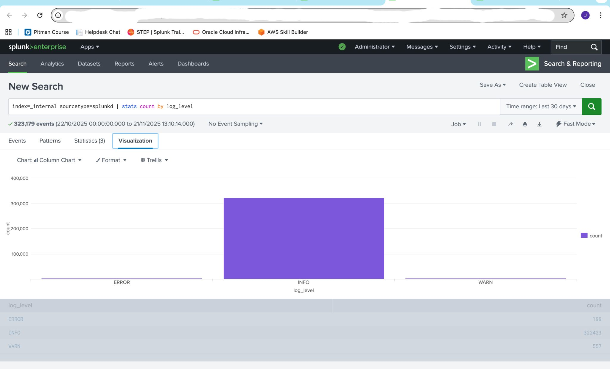
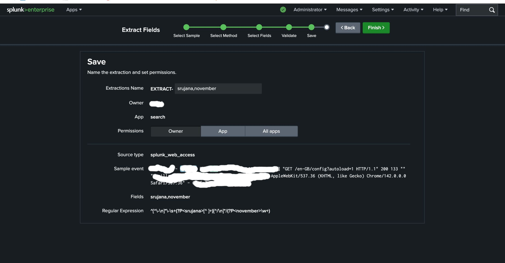
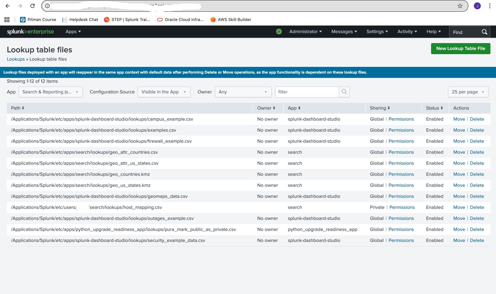
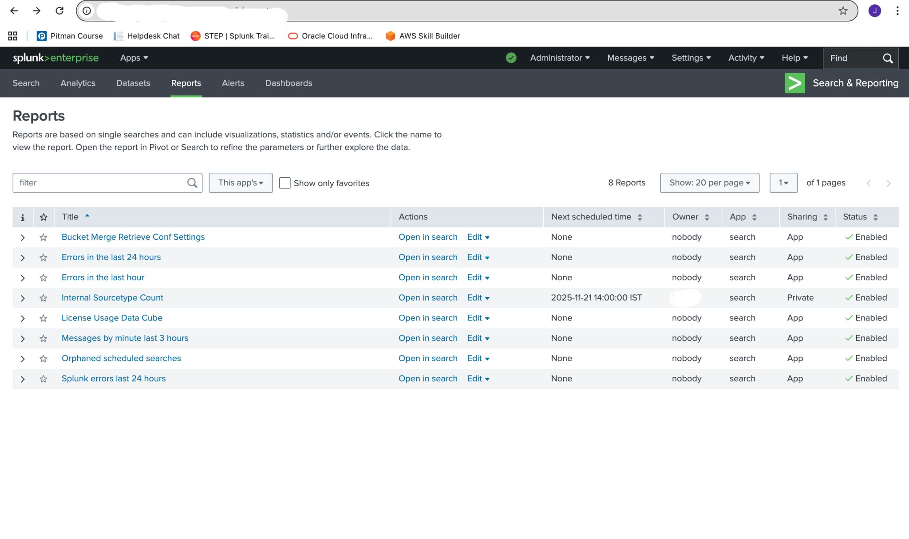
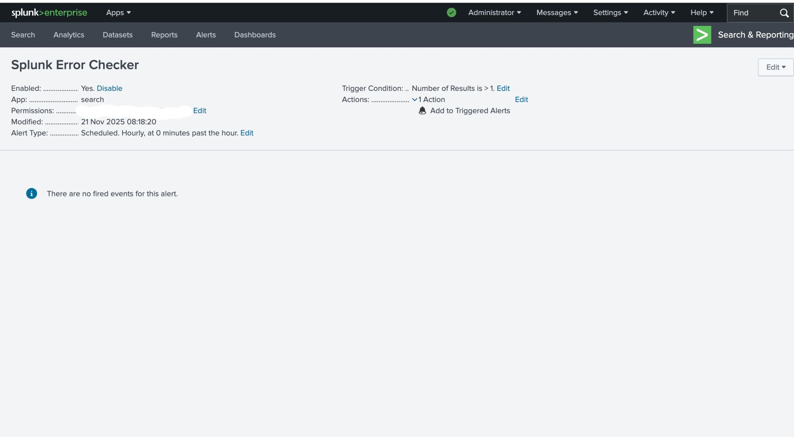

## 🔹 Splunk Log Analysis Project
### 📌 Overview

This project demonstrates hands-on experience using Splunk Enterprise for log analysis, field extraction, reporting, and alert creation.

🔧 Tools Used

Splunk Enterprise

Search Processing Language (SPL)

📊 Tasks Performed
1. Log Analysis

Performed log search using SPL queries

Example query:

index=_internal sourcetype=splunkd | stats count by log_level

Visualized logs using charts

2. Field Extraction

Extracted custom fields from raw logs

Used regular expressions for parsing data

Validated extracted fields

3. Reports Creation

Created reports based on log data

Analyzed system logs and errors

4. Alert Configuration

Created alerts based on conditions

Example: Trigger alert when error count > threshold

### 📸 Screenshots

#### Log Analysis

#### Field Extraction

#### Reports

#### Alerts

#### Additional View

🎯 Outcome

Gained practical experience in log monitoring and analysis

Learned to create alerts and reports in Splunk

Improved understanding of system log behavior
